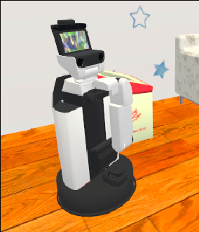
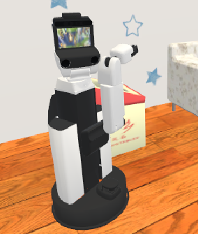
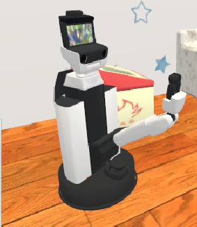

<a name="readme-top"></a>

[JA](README.md) | [EN](README.en.md)

[![Contributors][contributors-shield]][contributors-url]
[![Forks][forks-shield]][forks-url]
[![Stargazers][stars-shield]][stars-url]
[![Issues][issues-shield]][issues-url]
[![License][license-shield]][license-url]

# hsr_sim_common

<!-- 目次 -->
<details>
  <summary>目次</summary>
  <ol>
    <li>
      <a href="#概要">概要</a>
    </li>
    <li>
      <a href="#セットアップ">セットアップ</a>
      <ul>
        <li><a href="#環境条件">環境条件</a></li>
        <li><a href="#インストール方法">インストール方法</a></li>
      </ul>
    </li>
    <li>
    　<a href="#実行操作方法">実行・操作方法</a>
      <ul>
        <li><a href="#Launchの起動">Launchの起動</a></li>
      </ul>
    </li>
    <li>
    　<a href="#ソフトウェア">ソフトウェア</a>
      <ul>
        <li><a href="#物体把持">物体把持</a></li>
        <li><a href="#ポーズの変更">ポーズの変更</a></li>
      </ul>
    </li>
    <li><a href="#マイルストーン">マイルストーン</a></li>
    <!-- <li><a href="#contributing">Contributing</a></li> -->
    <!-- <li><a href="#license">License</a></li> -->
    <li><a href="#参考文献">参考文献</a></li>
  </ol>
</details>


<!-- レポジトリの概要 -->
## 概要

これは，HSR(SIGVerse)を動かすために必要なパッケージです．
ロボットのmeshやdiscriptionはここでinstallします．また物体把持やポーズの関数もこのパッケージで指定しています．


<!-- セットアップ -->
## セットアップ

ここで，本レポジトリのセットアップ方法について説明します．

<p align="right">(<a href="#readme-top">上に戻る</a>)</p>


### 環境条件

まず，以下の環境を整えてから，次のインストール段階に進んでください．

| System  | Version |
| ------------- | ------------- |
| Ubuntu | 20.04 (Focal Fossa) |
| ROS | Noetic Ninjemys |
| Python | 3.8 |

> [!NOTE]
> `Ubuntu`や`ROS`のインストール方法に関しては，[SOBITS Manual](https://github.com/TeamSOBITS/sobits_manual#%E9%96%8B%E7%99%BA%E7%92%B0%E5%A2%83%E3%81%AB%E3%81%A4%E3%81%84%E3%81%A6)に参照してください．

<p align="right">(<a href="#readme-top">上に戻る</a>)</p>


### インストール方法

1. ROSの`src`フォルダに移動します．
   ```sh
   $ roscd
   # もしくは，"cd ~/catkin_ws/"へ移動．
   $ cd src/
   ```
2. 本レポジトリをcloneします．
   ```sh
   $ git clone https://github.com/TeamSOBITS/hsr_sim_common
   ```
3. レポジトリの中へ移動します．
   ```sh
   $ cd /hsr_sim_common
   ```
4. 依存パッケージをインストールします．
   ```sh
   $ bash install.sh
   ```
   以下のコマンドを入力して，HSRを動かすための環境設定を行います．  
   この設定は，初回のみに行う作業ですので，1度行ったことのある人は飛ばしてください．

    ```bash:
    $ roscd hsr_ros
    $ chmod 755 install.sh
    $ sudo ./install.sh
    ```

5. パッケージをコンパイルします．
   ```sh
   $ roscd
   # もしくは，"cd ~/catkin_ws/"へ移動．
   $ catkin_make
   ```

<p align="right">(<a href="#readme-top">上に戻る</a>)</p>


<!-- 実行・操作方法 -->
## 実行・操作方法

1. HSRの起動する機能をパラメータとして[minimal.launch](hsr_sim_common/launch/minimal.launch)に設定します．
   ```xml
    roslaunch hsr_sim_common minimal.launch
    ...
   ```

<p align="right">(<a href="#readme-top">上に戻る</a>)</p>


## ソフトウェア

### 物体把持
exampleフォルダに入ってある, grasp.pyを参照してください.

#### 関数の説明

1. grasp_to_target_coord
指定した3次元座標に存在する物体をHSRが把持する関数

2. open_gripper
グリッパーを開く関数

3. close_gripper
グリッパーを閉じる関数

※ exampleに関しては随時追加予定です。

### ポーズの変更
hsr_rosパッケージのjoint_controller.py(hsr_ros/src)の関数を呼び出すことでHSRを以下のようなPose（姿勢）にすることができます.
<div align="center">
 <p>
    
     
     
 </p>
</div>

左から

#### ①initial_pose  
用途：自律移動をする際に用いるpose(姿勢)  
説明：アームが移動中に衝突しないようにする姿勢  
関数名：move_to_initial_pose（joint_controller.py） 

#### ②detecting_pose  
用途：物体認識の際に用いるpose(姿勢)  
説明：物体を認識する際に，カメラのフレーム内にアームが映らないようにする姿勢  
関数名：move_to_detecting_pose（joint_controller.py） 

#### ③measurement_pose  
用途：物体の高さを計測する際に用いるpose(姿勢)  
説明：この姿勢を用いることで，物体の高さを求めることができ，安全な物体の配置が可能  
関数名：move_to_measurement_pose（joint_controller.py）  


<p align="right">(<a href="#readme-top">上に戻る</a>)</p>


<!-- マイルストーン -->
## マイルストーン

- [x] exampleファイルの修正
- [x] OSS
    - [x] ドキュメンテーションの充実
    - [x] コーディングスタイルの統一

現時点のバッグや新規機能の依頼を確認するために[Issueページ][issues-url] をご覧ください．

<p align="right">(<a href="#readme-top">上に戻る</a>)</p>


<!-- CONTRIBUTING -->
<!-- ## Contributing

Contributions are what make the open source community such an amazing place to learn, inspire, and create. Any contributions you make are **greatly appreciated**.

If you have a suggestion that would make this better, please fork the repo and create a pull request. You can also simply open an issue with the tag "enhancement".
Don't forget to give the project a star! Thanks again!

1. Fork the Project
2. Create your Feature Branch (`git checkout -b feature/AmazingFeature`)
3. Commit your Changes (`git commit -m 'Add some AmazingFeature'`)
4. Push to the Branch (`git push origin feature/AmazingFeature`)
5. Open a Pull Request

<p align="right">(<a href="#readme-top">上に戻る</a>)</p> -->


<!-- LICENSE -->
<!-- ## License

Distributed under the MIT License. See `LICENSE.txt` for more NOTErmation.

<p align="right">(<a href="#readme-top">上に戻る</a>)</p> -->


<!-- MARKDOWN LINKS & IMAGES -->
<!-- https://www.markdownguide.org/basic-syntax/#reference-style-links -->
[contributors-shield]: https://img.shields.io/github/contributors/TeamSOBITS/hsr_sim_common.svg?style=for-the-badge
[contributors-url]: https://github.com/TeamSOBITS/hsr_sim_common/graphs/contributors
[forks-shield]: https://img.shields.io/github/forks/TeamSOBITS/hsr_sim_common.svg?style=for-the-badge
[forks-url]: https://github.com/TeamSOBITS/hsr_sim_common/network/members
[stars-shield]: https://img.shields.io/github/stars/TeamSOBITS/hsr_sim_common.svg?style=for-the-badge
[stars-url]: https://github.com/TeamSOBITS/hsr_sim_common/stargazers
[issues-shield]: https://img.shields.io/github/issues/TeamSOBITS/hsr_sim_common.svg?style=for-the-badge
[issues-url]: https://github.com/TeamSOBITS/hsr_sim_common/issues
[license-shield]: https://img.shields.io/github/license/TeamSOBITS/hsr_sim_common.svg?style=for-the-badge
[license-url]: LICENSE

