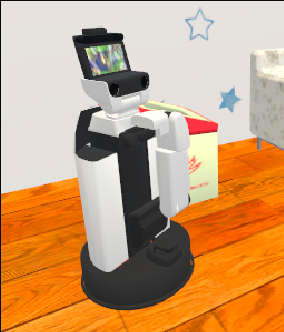
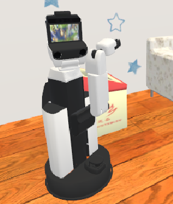
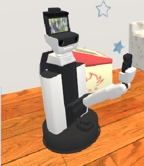

<a name="readme-top"></a>

[JP](README.md) | [EN](README.en.md)

[![Contributors][contributors-shield]][contributors-url]
[![Forks][forks-shield]][forks-url]
[![Stargazers][stars-shield]][stars-url]
[![Issues][issues-shield]][issues-url]
[![License][license-shield]][license-url]

# HSR Sim Common

<!-- 目次 -->
<details>
  <summary>目次</summary>
  <ol>
    <li>
      <a href="#概要">概要</a>
    </li>
    <li>
      <a href="#セットアップ">セットアップ</a>
      <ul>
        <li><a href="#環境条件">環境条件</a></li>
        <li><a href="#インストール方法">インストール方法</a></li>
      </ul>
    </li>
    <li>
    　<a href="#実行操作方法">実行・操作方法</a>
    </li>
    <li>
    　<a href="#ソフトウェア">ソフトウェア</a>
      <ul>
        <li><a href="#点群">点群</a></li>
        <li><a href="#ライブラリサーバー">ライブラリサーバー</a></li>
        <li><a href="#ポーズの変更">ポーズの変更</a></li>
      </ul>
    </li>
    <li><a href="#マイルストーン">マイルストーン</a></li>
    <!-- <li><a href="#contributing">Contributing</a></li> -->
    <!-- <li><a href="#license">License</a></li> -->
    <!-- <li><a href="#参考文献">参考文献</a></li> -->
  </ol>
</details>


<!-- レポジトリの概要 -->
## 概要

これは，HSR(SIGVerse)を動かすために必要なパッケージです．
ロボットのmeshやdiscriptionはここでinstallします．また物体把持やポーズの関数もこのパッケージで指定しています．


<!-- セットアップ -->
## セットアップ

ここで，本レポジトリのセットアップ方法について説明します．

<p align="right">(<a href="#readme-top">上に戻る</a>)</p>


### 環境条件

まず，以下の環境を整えてから，次のインストール段階に進んでください．

| System  | Version |
| ------------- | ------------- |
| Ubuntu | 22.04 (Jammy Jellyfish) |
| ROS | Humble Hawksbill |
| Python | 3.0~ |

<p align="right">(<a href="#readme-top">上に戻る</a>)</p>


### インストール方法

1. 以下のコマンドでhsr_sim_commonパッケージをcloneします．
   ```sh
   cd ~/colcon_ws/src/
   ```
   ```sh
   git clone -b humble-devel https://github.com/TeamSOBITS/hsr_sim_common.git
   ```
2. install.shで依存関係をインストールします．主に以下が含まれています．
   - Mongo C driver
     - SIGVerse環境でHSRを制御するにはMongoを用いる必要があります．
     - Mongoとは，代表的なNoSQLデータベース・ドキュメント指向型データベースのことです．
   - Mongo C++ driver
     - 同様にしてC++用のドライバもインストールします．
   - sigverse_ros_bridgeの設定
     - Windows側のSIGVerseとUbuntu側のROS2をbridgeするためにインストールします．
   ```sh
   cd hsr_sim_common
   ```
   ```sh
   bash install.sh
   ```
3. colcon buildします
   ```sh
   cd ~/colcon_ws/
   ```
   ```sh
   colcon build
   ```
<p align="right">(<a href="#readme-top">上に戻る</a>)</p>


<!-- 実行・操作方法 -->
## 実行・操作方法
1. SIGVerseと接続後，[minimal.launch.py](launch/minimal.launch.py)を実行します．
   ```sh
    ros2 launch hsr_sim_common minimal.launch.py
   ```
2. [teleop_key.launch.py](launch/teleop_key.launch.py)を起動することで，ロボットを操作できます．
   ```sh
   ros2 launch hsr_sim_common teleop_key.launch.py
   ```
  <details>
    <summary>キーボード操作方法</summary>
    
- 移動操作 (通常モード)
    
  | | | |
  |---|---|---|
  | u | i | o |
  | j | k | l |
  | m | , | . |
  
- ホロノミックモード (横移動)
  - シフトキーを押しながら操作すると、横移動 (strafing) ができます。
  
  | | | |
  |---|---|---|
  | U | I | O |
  | J | K | L |
  | M | < | > |
  
- 矢印キーでのシンプルなテレポート操作
  
  | | | |
  |---|---| --- |
  | | ↑ (A) | |
  | ← (D) |  | → (C) |
  | | ↓ (B) | |
  
- 速度調整と関節操作
  - q / z: 最大速度を10%ずつ増減
  - w / x: リニア速度（直線移動速度）のみを10%ずつ増減
  - e / c: 角速度（回転速度）のみを10%ずつ増減
  - a + 矢印キー: arm_lift_joint を操作
  - s + 矢印キー: arm_flex_joint と arm_roll_joint を操作
  - d + 矢印キー: wrist_flex_joint と wrist_roll_joint を操作
  - f + 矢印キー: head_pan_joint と head_tilt_joint を操作
  - y + 矢印キー: linear_x と linear_y と angular_z を操作
  - g: ハンドの開閉を切り替え
  - h: 初期姿勢へ移動

  </details>

<p align="right">(<a href="#readme-top">上に戻る</a>)</p>


## ソフトウェア

### 点群
- [generate_pointcloud.launch.py](launch/generate_pointcloud.launch.py)を起動することで点群をパブリッシュできます．
- このファイルは[minimal.launch.py](launch/minimal.launch.py)の実行で自動的に実行されます．

### ライブラリサーバー
- [library_server.launch.py](launch/library_server.launch.py)を起動することで，ポーズの変更，水平移動，回転，各関節角の変更，指定したTFまでハンドを移動させるための情報などをやりとりするためのAction Serverが起動します．
- このファイルは[minimal.launch.py](launch/minimal.launch.py)の実行で自動的に実行されます．

### ポーズの変更
- [pose_list.yaml](config/pose_list.yaml)を書き換えることで，利用可能なポーズを変更することができます．
<div align="center">
 <p>
    
     
     
 </p>
</div>

左から

#### ①initial_pose  
用途：自律移動をする際に用いるpose(姿勢)  
説明：アームが移動中に衝突しないようにする姿勢  

#### ②detecting_pose  
用途：物体認識の際に用いるpose(姿勢)  
説明：物体を認識する際に，カメラのフレーム内にアームが映らないようにする姿勢  

#### ③measurement_pose  
用途：物体の高さを計測する際に用いるpose(姿勢)  
説明：この姿勢を用いることで，物体の高さを求めることができ，安全な物体の配置が可能  

<p align="right">(<a href="#readme-top">上に戻る</a>)</p>


<!-- マイルストーン -->
## マイルストーン

現時点のバッグや新規機能の依頼を確認するために[Issueページ][issues-url] をご覧ください．

<p align="right">(<a href="#readme-top">上に戻る</a>)</p>


<!-- CONTRIBUTING -->
<!-- ## Contributing

Contributions are what make the open source community such an amazing place to learn, inspire, and create. Any contributions you make are **greatly appreciated**.

If you have a suggestion that would make this better, please fork the repo and create a pull request. You can also simply open an issue with the tag "enhancement".
Don't forget to give the project a star! Thanks again!

1. Fork the Project
2. Create your Feature Branch (`git checkout -b feature/AmazingFeature`)
3. Commit your Changes (`git commit -m 'Add some AmazingFeature'`)
4. Push to the Branch (`git push origin feature/AmazingFeature`)
5. Open a Pull Request

<p align="right">(<a href="#readme-top">上に戻る</a>)</p> -->


<!-- LICENSE -->
<!-- ## License

Distributed under the MIT License. See `LICENSE.txt` for more NOTErmation.

<p align="right">(<a href="#readme-top">上に戻る</a>)</p> -->


<!-- MARKDOWN LINKS & IMAGES -->
<!-- https://www.markdownguide.org/basic-syntax/#reference-style-links -->
[contributors-shield]: https://img.shields.io/github/contributors/TeamSOBITS/hsr_sim_common.svg?style=for-the-badge
[contributors-url]: https://github.com/TeamSOBITS/hsr_sim_common/graphs/contributors
[forks-shield]: https://img.shields.io/github/forks/TeamSOBITS/hsr_sim_common.svg?style=for-the-badge
[forks-url]: https://github.com/TeamSOBITS/hsr_sim_common/network/members
[stars-shield]: https://img.shields.io/github/stars/TeamSOBITS/hsr_sim_common.svg?style=for-the-badge
[stars-url]: https://github.com/TeamSOBITS/hsr_sim_common/stargazers
[issues-shield]: https://img.shields.io/github/issues/TeamSOBITS/hsr_sim_common.svg?style=for-the-badge
[issues-url]: https://github.com/TeamSOBITS/hsr_sim_common/issues
[license-shield]: https://img.shields.io/github/license/TeamSOBITS/hsr_sim_common.svg?style=for-the-badge
[license-url]: LICENSE
